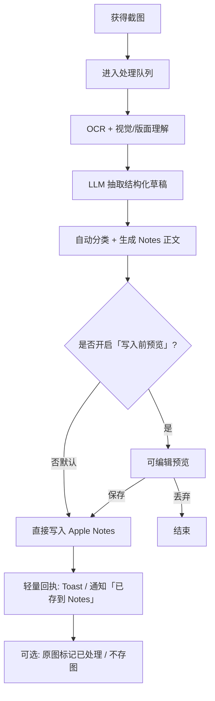

# PRD：截图信息提取 → Apple Notes

**状态：** Draft v0.8 · Platform: iOS · Import Shortcut onboarding  
**日期：** 2026-09-06  
**负责人：** PM  
**平台：** **iOS 优先**（iPhone；iPad 随形适配）。macOS 不在 MVP。

## 已拍板决策

| 决策 | 结论 | 日期 |
|------|------|------|
| 主场景 | 刷抖音 / Twitter / 公众号等时随手截图收藏 | 2026-09-06 |
| 存法节奏 | **截完直接进 Notes，步骤最少**；预览/编辑为可选，不挡主路径 | 2026-09-06 |
| 平台 | **iOS 优先** | 2026-09-06 |
| 入口 | **截图后自动进**（监听截图相册）；分享到 App **不作主路径** | 2026-09-06 |
| 存时交互 | **轻量筛选框**：给出分类选项 + **取消存入**；不是完整预览编辑页 | 2026-09-06 |
| 触发方式 | **系统截图绑定辅助操作 / 快捷指令自动化**为主；相册轮询为补漏 | 2026-09-06 |
| 首次引导 | **导入我们提供的快捷指令**，再绑到「截取屏幕时」（关运行前询问） | 2026-09-06 |

---

## 1. 背景与问题

用户日常大量截图用于「稍后收藏」：聊天金句、网页片段、课程要点、收据、灵感、待办等。现状痛点：

1. **收藏动作重**：截图后还要手动建笔记、复制文字、归类、起标题。
2. **截图堆相册**：信息沉没在图片里，难检索、难复用。
3. **结构不一致**：同类内容散落，后续找不到「当时为什么截」。

**产品一句话：**  
系统截图后自动抽出有效信息并分类，直接写入 Apple Notes——刷抖音时随手截即可，无需再点分享。

---

## 2. 目标与非目标

### 2.1 目标（MVP）

| 目标 | 说明 |
|------|------|
| G1 降摩擦 | 从「截图」到「Notes 里有一条可用笔记」**0 次额外点击**（理想）；失败时才需打开 App |
| G2 可检索 | Notes 中含可读正文 + 结构化字段（标题/摘要/标签/来源时间），支持系统搜索 |
| G3 可分类 | 按内容类型自动归类到预设类别（可改），映射到 Notes 文件夹或标签约定 |
| G4 可控 | 截图自动进入流程后弹出**轻量筛选框**（分类 / 取消）；超时未操作则按推荐分类自动存 |

### 2.2 非目标（MVP 不做）

- 不做跨账号云笔记同步中心（只写 Apple Notes）
- 不做完整知识库/双向链接（非 Notion 替代）
- 不做社交分享、协作编辑
- 不做常驻隐蔽截屏监控（隐私与商店审核风险高；入口策略见后）
- 不做精确版面还原为可编辑设计稿

---

## 3. 用户与场景

### 3.1 主要用户

- **知识工作者 / 学生**：课上、文章、聊天里看到要点就截。
- **效率控 Apple 用户**：已用 Notes，不愿再开第三套收藏 App。

### 3.2 核心 Jobs-to-be-Done

> 当我看到屏幕上有值得留的信息时，希望**几乎不用整理**就能在 Notes 里按类别找到它，以便以后搜索和回顾。

### 3.3 典型场景（以「刷内容随手存」为主）

**主场景：信息流里随手截**

1. **抖音 / 短视频**：画面文字、口播金句、评论区观点 → 截图 → 抽文案要点 + 话题标签 → Notes「灵感/方法」  
2. **Twitter / X**：长帖、线程截图、图文卡 → 抽正文与作者柄（若可见）→ Notes「灵感」或「收藏」  
3. **微信公众号**：文章段落、金句卡片、目录要点 → 抽标题感句子 + 正文 → Notes「方法/灵感」  
4. **小红书 / 其它信息流**（同类）：图文种草、清单 → 商品/清单结构化 → Notes「收藏」

**次场景（仍支持，非第一优先级）**

5. 聊天里的方法论、网页规格表、课件白板、快递单据等

### 3.4 体验原则（由主场景推导）

| 原则 | 含义 |
|------|------|
| 手不离开浏览 | 截完应能立刻回信息流；理想路径：系统截图后 1 步进处理，或稍后批量清「待处理」 |
| 懂信息流版式 | 针对短视频字幕条、推文气泡、公众号排版做抽取提示，减少把 UI 铬（点赞、推荐）当正文 |
| 可延后确认 | 刷的时候不想细改 → 支持「先收进收件箱，晚上再清」；深度编辑不挡主路径 |
| 来源可辨 | 笔记里标注疑似来源类型（抖音/Twitter/公众号/未知），便于以后回忆「在哪看到的」 |  

---

## 4. 解决方案概述

**信息流（平台无关）：**

```
截图输入 → 理解与抽取 → 分类与成稿 → 用户确认（可关） → 写入 Apple Notes → 可选归档原图
```

**输入方式（平台后定时再选优先级）：**

| 入口 | 描述 | 摩擦 | 备注 |
|------|------|------|------|
| A. 分享扩展 | 系统分享菜单选本 App | 低 | iOS 首选候选 |
| B. App 内导入 | 从相册选图 / 粘贴 | 中 | 兜底必做 |
| C. 新截图监听 | 监听截图相册/文件夹 | 极低 | 需强权限与明确同意 |
| D. 拖放/快捷指令 | Mac 拖入或 Shortcuts | 低 | macOS 友好 |

**MVP 建议默认路径（贴合「随手截」）：**

1. **P0：** **新截图自动检测 → 直写 Notes**；主 App「补漏」列表  
2. **P0：** 抽取后**默认直写 Notes**；Toast「已保存」；错误才打断  
3. **P0：** 低置信分类 → 仍写入「收件箱」文件夹，不弹预览（避免打断）  
4. **P1：** 新截图监听（可选）——适合抖音连续截，后台直写  
5. **P1：** 设置项「写入前预览」给想精修的人  

B（相册导入）仍作兜底。

---

## 5. 用户流程

### 5.1 主流程（推荐：截完直存 Notes）



**逐步说明：**

1. **获得截图**：分享进入 / 相册选取 /（可选）自动发现新截图。  
2. **处理中**：展示进度；弱网可排队。  
3. **存时筛选框**：抽取后弹出分类选项 + 取消；超时按推荐分类写入。  
4. **写入 Notes**：用户点选分类或不存；超时策略见 §7.1；成功给轻量 Toast/通知。  
5. **失败**：可重试；保留本地草稿，不丢图。

### 5.2 首次使用流程

1. 说明价值与权限：照片（截图）、通知；网络（若云端模型）。  
2. **一键导入我们提供的官方快捷指令**（跳转快捷指令 App 点添加）。  
3. 引导创建「截取屏幕时」自动化，选中该指令，并**关闭「运行前询问」**。  
4. 试截一张，确认筛选框出现（分类 / 不存）。  
5. （可选）Notes 文件夹映射；辅助触控 / 背面轻点为加分项。  

细节与排障见 §7.1「首次使用流程（导入快捷指令）」。

### 5.3 批量流程（可后置）

多选截图 → 串行处理 → 列表确认 → 批量写入。MVP 可只做单张，批量 v1.1。

### 5.4 修正流程

Notes 写错类别/标题：App 内「最近写入」可「改分类并更新笔记」或「追加更正」（取决于 Notes API 能力；若不可更新则新建并标注）。

---

## 6. 信息架构与分类

### 6.1 默认类别（可配置）

| 类别 ID | 名称 | 典型信号 | Notes 映射（默认） |
|---------|------|----------|-------------------|
| insight | 观点/金句 | 短句、金句、名言感 | 文件夹「灵感」 |
| howto | 方法/教程 | 步骤、列表、How to | 文件夹「方法」 |
| task | 待办 | 动词开头、DDL、清单 | 文件夹「待办」或带 checkbox 正文 |
| receipt | 单据 | 金额、单号、发票 | 文件夹「单据」 |
| contact | 联系信息 | 电话、微信、邮箱 | 文件夹「联系人」 |
| product | 商品/资料 | 价格、型号、参数表 | 文件夹「收藏」 |
| other | 其他 | 低置信 | 文件夹「收件箱」 |
| inbox | 待清理 | 「稍后清理」模式的默认落点 | 文件夹「收件箱」 |

**信息流增强（v0.2）：** 抽取时额外推断 `source_guess`: `douyin | twitter | wechat_article | xiaohongshu | chat | web | unknown`，写入笔记元数据；分类仍用上表，不按 App 建文件夹（避免碎片化）。

用户可：增删类别、改名、改目标文件夹。

### 6.2 单条笔记建议结构（写入 Notes 的正文模板）

```text
# {标题}

> 摘要：{一句话}

**类别：** {类别}
**标签：** #截图收藏 #{类别} {自定义标签}
**截取时间：** {screenshot_time}
**写入时间：** {saved_at}

---

{正文：OCR 清理后的可读文本，保留关键列表/数字}

---

**结构化字段**
- 关键实体：…
- 链接/ID：…
- 金额/日期：…（如有）

**来源：** 用户截图（App 不声称网页 URL，除非 OCR/元数据明确读到）
```

### 6.3 置信度与人工介入

- 分类置信度 < 阈值 → 默认「收件箱」并在预览高亮「请确认类别」。  
- OCR 几乎无字（纯图/模糊）→ 走「图像备注」模式：视觉描述 + 用户可补一句，仍可存 Notes。

---

## 7. 功能需求（MVP）

### 7.1 必须有（P0）

1. **首次导入官方快捷指令并绑定「截取屏幕时」**（主路径 onboarding）  
2. 截图触发后：**筛选框** + 相册补漏 + 手动选图兜底  
3. OCR（印刷体优先；手写尽力）  
4. 信息抽取：标题、摘要、正文、类别、标签、关键实体  
5. **存时筛选框**（分类 chips + 取消存入 + 超时策略）  
6. 写入 Apple Notes（按所选/推荐类别对应文件夹）  
7. 处理历史列表（最近 N 条：成功/失败）  
8. 权限与隐私说明；本地优先策略可配置  

### 7.2 应当有（P1）

1. 自动写入开关  
2. 类别与文件夹映射设置  
3. 批量导入  
4. 多语言截图（中英混合）  
5. 「仅文字 / 文字+缩略图」写入选项（缩略图视 Notes 附件能力）

### 7.3 可以有（P2）

1. 新截图自动监听  
2. Shortcuts / 系统自动化集成  
3. 自定义抽取模板（如「只抽待办」）  
4. 周报：本周收藏统计  

---

## 8. Apple Notes 集成要点（平台后定，需验证）

| 能力 | 说明 | 风险 |
|------|------|------|
| 创建笔记 | 标题 + body（富文本/Markdown 降级为纯文本） | API/系统限制因平台而异 |
| 指定文件夹 | 按名称匹配或首次创建 | 文件夹重名 |
| 更新已有笔记 | 未必可用 | MVP 可只创建 |
| 附件原图 | 可选 | 体积与隐私 |

**原则：** 以「用户在 Notes App 里能搜到正文」为成功标准，不绑死私有同步协议。

**实现候选（选型阶段再定）：**

- iOS：App Intent / Share Extension + Notes API / 或通过「创建笔记」URL scheme / Shortcuts  
- macOS：AppleScript/Automation、Shortcuts、或 Notes 相关框架  

PRD 阶段只要求：**写入路径必须可演示、可失败重试、不造成重复风暴（防连点双写）**。

## 7.1 iOS 实现约束（v0.5 · 自动截图）

### 主入口：截图后自动进（无分享）

**用户期望：** 在抖音等 App 里按系统截图 → **不再点分享** → 出现筛选框 → 分类或不存 → 进备忘录。

#### 触发方式 A（P0 首选）：系统截图绑定「辅助 / 快捷指令」

用苹果自带能力，把**截图动作**接到本 App，而不是让用户再走分享菜单。

| 方案 | 做法 | 优点 | 注意 |
|------|------|------|------|
| **快捷指令自动化** | 「自动化 → 创建个人自动化 → **截取屏幕时**」→ 运行「打开本 App / App Intent：处理最新截图」 | 官方、可说明、和截图强绑定 | 首次需用户在「快捷指令」里允许运行；部分系统版本对自动化有「运行前询问」开关，**引导里教用户关掉询问**，否则又多一步 |
| **辅助触控 / 辅助功能快捷键** | 自定义手势或辅助触控菜单绑定「截屏」或绑定已装快捷指令 | 符合「辅助操作」心智 | 截屏仍是系统截屏；绑定的是触发链的一环，要在 onboarding 写清怎么设 |
| **背面轻点（Back Tap）** | 设置 → 辅助功能 → 触控 → 背面轻点 → 执行快捷指令 | 可当「第二截图键」或「处理刚截的图」 | 与音量+电源截图可并存；适合不想改截图手势的用户 |

**Onboarding（必做 · v0.8）：导入官方快捷指令包，再完成绑定。**

### 首次使用流程（导入快捷指令）

目标：用户**不自己从零搭自动化**，只做「导入 → 允许 → 关掉询问 → 试截一张」。

| 步骤 | 界面 | 用户动作 | 系统结果 |
|------|------|----------|----------|
| 1 | 欢迎页 | 说明「截图后自动整理进备忘录」 | — |
| 2 | 权限 | 开照片（截图）、通知 | 可写补漏与回执 |
| 3 | **导入快捷指令** | 点「添加快捷指令」→ 跳转快捷指令 App 打开我们下发的 **iCloud 链接 / Safari 导入页**（`shortcuts://` 或官方分享链） | 用户点「添加快捷指令」，得到「截图存到备忘录」指令（内含 App Intent：处理最新截图 → 展示筛选框 → 写 Notes） |
| 4 | **绑定自动化** | 引导图文：快捷指令 App → 自动化 → 创建个人自动化 → **截取屏幕时** → 选择刚导入的指令 → **关闭「运行前询问」** | 之后每次系统截图都跑该指令 |
| 5 | 试跑 | 「现在去截一张试试」 | 出现筛选框 = 成功；失败则展示排障（是否关询问、是否选对指令）并提供「重新导入」 |
| 6 | 完成 | 可进主 App；提示辅助触控/背面轻点为可选加强 | 相册补漏开关默认开 |

**产品要求：**

1. App 内只提供**一个**官方指令模板（版本号可见）；升级 Intent 时提示「更新快捷指令」。  
2. 导入链失效要有备用（内嵌签名的 `.shortcut` 若分发渠道允许，或重新生成链接）。  
3. **不要**默认假设用户会自己配置；任何「去设置里自己找」都算引导失败。  
4. 若用户跳过导入：主 App 仍可用手动选图 + 补漏，但首页持续露出「未开启截图自动保存」横幅。  

**快捷指令内部逻辑（给 RD / 模板作者）：**

```text
当被「截取屏幕时」调用
  → App Intent: ProcessLatestScreenshot
  →（可选）传入当前截图文件若自动化提供输入
  → 拉起筛选框 UI（分类 / 不存）
  → 按选择写入 Apple Notes
```

#### 触发方式 B（P0 补漏）：图库新截图检测

| 优先级 | 机制 | 说明 |
|--------|------|------|
| **P0** | 监听新截图 + 主 App「补漏」 | 自动化没开、被系统杀掉时的兜底 |
| **P1** | 通知「已存到备忘录」 | 写入成功后的反馈 |
| **不做主路径** | Share Extension | 分享路径太长 |

**目标步数：** 系统截图（键或辅助触发）→ **自动**出现筛选框 → 点分类 / 不存 / 超时按推荐存。

### 存时筛选框（v0.6 · P0）

截图被识别并完成初抽取后，立即出示轻量 UI（优先：**动态岛 / 横幅通知点开的快捷面板**，或短时全宽底部 sheet——技术 spike 定形态；原则是**不强制进主 App 全屏**）。

**框内元素（最少）：**

| 元素 | 行为 |
|------|------|
| 推荐分类（高亮） | 展示模型建议类别，如「灵感」「方法」「待办」… |
| 其它分类选项 | 横向 chips / 列表，一点即选中并触发写入 |
| **不存 / 取消** | 丢弃本张，不写 Notes；可进「已忽略」防短时间重复弹 |
| （可选）缩略图 | 小图确认「是这张截图」，避免误存 |

**交互节奏（与「少步骤」对齐）：**

1. 弹出筛选框，**默认已选中推荐分类**。  
2. 用户点另一分类 → 立即按该分类写入 Notes → 框消失 → 可选 Toast「已存到××」。  
3. 用户点**不存** → 关闭，不写。  
4. **超时（建议 5–8s，可设）无操作** → 按推荐分类自动写入（保证「懒得点也能存」）；若用户强烈反感超时自动存，设置可改为「超时则不存」。  
5. MVP **不做**框内改标题/改正文（那是完整编辑，步骤变重）；要改去 App 历史里「最近一条」。

**与「零点击」的关系：**  
零点击 = 不走分享、不进主 App；筛选框是**可选的一指决策**。超时自动存则仍接近零点击。

**诚实上限（必须对齐预期）：**

1. 没有公开 API 接管系统截图缩略图浮层；不能私有 hook 抖音进程。  
2. **首选**走系统「截取屏幕时」自动化 / 辅助绑定，事件驱动更接近「截完就弹筛选框」。  
3. 相册监听仅补漏；文案可写「截图后自动整理」，仍避免承诺「绝对瞬时」。  
4. 首次 onboarding：开自动化（关「运行前询问」）+ 照片权限 + 通知；并提供辅助触控/背面轻点的备选绑定说明。

### Notes 写入（iOS）

- 主路径在 **主 App / 后台任务** 内完成创建笔记，不经过「分享到备忘录」面板。  
- MVP 技术 spike（阻塞项）：① 可分发的快捷指令模板 + 导入链接；② 「截取屏幕时」自动化调用 App Intent 并拉起筛选框；③ 关「运行前询问」的引导点击率；④ Intent 写 Notes；⑤ 指令版本升级提示。  
- **验收：** 用户只截图、不点分享；在可接受延迟内 Notes 出现新笔记；重复截图不双写。

### 权限文案要点

- 照片：用于检测并读取你的**新截图**（自动保存）。  
- 网络：用于理解截图内容（可关，关后仅 OCR）。  
- 通知：用于「已保存到备忘录」回执。

### 审核与产品风险

- 自动监听 **首次强同意**，设置里可随时关；禁止暗示「无感读取全部相册」。  
- 不依赖私有 API；隐私营养标签如实披露照片与（若有）云端处理。


---

## 9. 模型与处理管线

1. **OCR**：系统 Vision 优先（端侧）；不足再云端。  
2. **理解抽取**：LLM（端侧小模型或云端）；输入为 OCR 文本 + 可选缩略图。  
3. **输出 schema（示例）：**

```json
{
  "title": "string",
  "summary": "string",
  "category": "insight|howto|task|receipt|contact|product|other",
  "category_confidence": 0.0,
  "tags": ["string"],
  "body": "string",
  "entities": {"dates": [], "amounts": [], "ids": [], "contacts": []},
  "needs_review": true
}
```

4. **安全：** 截图可能含聊天隐私；默认提示「将发送至云端处理」开关；提供「仅端侧」模式（能力降级可接受）。

---

## 10. 体验与合规

- 最小化权限；监听相册必须单独明示开关。  
- 不上传不必要原图；可配置「只传 OCR 文本」。  
- 不在服务端做广告画像。  
- 清除数据：删除历史与服务器副本（若有）。  
- App Store / 隐私营养标签如实披露。

---

## 11. 成功指标

| 指标 | MVP 目标（上线 4 周） |
|------|----------------------|
| 激活到首次成功写入 | ≥ 60% |
| 自动写入成功率（检测到截图→Notes） | ≥ 90% |
| 用户感知「还要多点一下」的投诉 | 趋近 0（主路径） |
| 写入成功率 | ≥ 95% |
| D7 留存 | 观察性指标，先不设硬门 |

质性：用户是否觉得「比手敲 Notes 更快」。

---

## 12. 里程碑（平台确定后可排期）

| 阶段 | 产出 |
|------|------|
| M0 | 本 PRD 评审 + ~~平台决策~~ ✅ iOS；Notes 写入技术 spike |
| M1 | 单路径导入 + OCR + 预览（尚不写 Notes，可导出 Markdown） |
| M2 | Notes 写入打通 + 类别映射 |
| M3 | 历史/设置/自动写入 + 隐私模式 |
| M4 | 打磨分类准确率与模板；准备 TestFlight |

---

## 13. 开放问题（需你拍板）

1. ~~平台优先~~ → **已定：iOS**  
2. **默认交互：** 每次确认 vs 自动写入？  
3. **云端 LLM：** 是否接受？预算与供应商偏好？  
4. **原图是否进 Notes：** 默认附带还是只存文字？  
5. **类别体系：** 用上文默认类，还是你有领域专用类（如「竞品」「面试题」）？  
6. ~~随手存节奏~~ → **已定：截完立刻进 Notes**  
7. **短视频特例：** 抖音是否需要「多帧/录屏片段」还是 MVP 只做单张截图？

---

## 14. 附录：用户故事（MVP）

1. 作为用户，我可以把一张截图导入 App，以便不用手打字就能生成笔记草稿。  
2. 作为用户，我可以在写入前改标题和类别，以便 Notes 里分类正确。  
3. 作为用户，我确认后笔记出现在 Apple Notes 指定文件夹，以便我用系统搜索找到它。  
4. 作为用户，我可以关闭云端处理，以便敏感截图只在本地完成基础 OCR（能力可降级）。  
5. 作为用户，我能看到最近写入是否成功，以便失败时重试而不是以为丢了。
